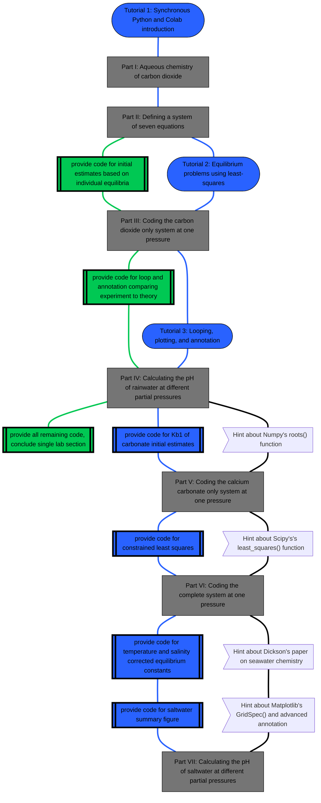

# $\mathrm{CO_2}$-Equilibrium

This repository is designed to be a customizable set of resources to facilitate the understanding of the inorganic chemistry of carbon in water. Instructors are welcomed and encouraged to adapt and modify the materials to meet their specific goals and time constraints.

## Repository Contents:

A. An introduction to scientific Python programming using Google Colab along with the Numpy, Matplotlib, and Pandas libraries. [Python Introduction](https://colab.research.google.com/github/wphall/CO2-Equilibrium/blob/main/Python_Introductory_Activity_KEY.ipynb) using provided [spectral data](https://github.com/wphall/CO2-Equilibrium/blob/6cc06acdc6d6ce9b7077940b030278e7fa9bd21c/Spectral%20Data.xlsx)

B. An introduction to solving equilibrium problems using mass balance, charge balance, and non-linear least squares. [Solving Equilibrium Problems Using Python](https://colab.research.google.com/github/wphall/CO2-Equilibrium/blob/main/Solving_Equilibrium_Problems_Using_Python.ipynb)

C. The main activity divided into seven parts in which students build a model for the interaction of atmospheric carbon dioxide with natural waters. [Student Notebook CO2 Equilibrium](https://colab.research.google.com/github/wphall/CO2-Equilibrium/blob/main/Student_Notebook_CO2_Equilibrium.ipynb#scrollTo=DQFCCLpto973) along with a fully complete and executable [Instructor Notebook CO2 Equilibrium](https://colab.research.google.com/github/wphall/CO2-Equilibrium/blob/main/Instructor_Notebook_CO2_Equilibrium.ipynb)
* Parts I to III: a closed system starting with only $\mathrm{CO_2}$ and $\mathrm{H_2O}$ is described and defined in Python. The equilibrium concentrations of atmospheric $\mathrm{CO_2}$ and the aqueous species $\mathrm{[CO_2], [HCO_3^-], [CO_3^{2-}], [H_3O^+]}$, and $\mathrm{[OH^-]}$ are calculated.  In this portion of the student notebook, many of the code segments are left blank and are intended to be filled in by the students as they work through the calculations.

    * An optional introduction to looping in Python, storing large datasets as a Pandas dataframe, and plotting using Matplotlib with annotation and labeling. [Loops_and_Plotting_in_Python](https://colab.research.google.com/github/wphall/CO2-Equilibrium/blob/main/Loops_and_Plotting_in_Python.ipynb)

* Part IV is a study of the effect of atmospheric $\mathrm{CO_2}$ on the pH of rainwater.  At the end of this section the students will have made a plot of pH as a function of partial pressure of atmospheric $\mathrm{CO_2}$ and compared their experimental results with theory.  Some instructors may choose to stop here.

* Parts V and VI build on the previous sections by considering first the solid $\mathrm{CaCO_3}$ only system (Part V) and then combining the carbon inputs of both atmospheric carbon dioxide and solid calcium carbonate (Part VI).  This mixed system is complex, and other Python functions for constrained non-linear least squares fitting are introduced.

* Part VII takes into account the effects of temperature and ionic strength.  Due to the complexity of this system, a larger amount of the code is provided.  By the end of the notebook, students construct a model for understanding the effect of atmospheric $\mathrm{CO_2}$ on the pH of saltwater that is saturated with limestone.

## Usage:
In most cases a "key" is provided so that instructors (or self-paced students) have access to fully working and complete code.  After considering the materials in the repository, you are encouraged to remove some of this provided code and allow for  supervised time within the lab or self-paced assignments to be completed outside of lab. The essential skills involved in writing and debugging a script can only be learned through doing.  

At our institution, The University of Portland, Python programming and other computational techniques are distributed across multiple instructors and subdisciplines.  The Physical Chemistry I lab is set up so that groups of students rotate through a variety of experiments during the semester, performing them on different weeks.  This activity fits into our curriculum as follows:

* Section A is completed during an early, introductory lab period with all students working on the same activity and little provided code. (1.5 - 2 hours)

* Section B is completed as self-paced activity outside class time prior to a group rotating into this experiment (1 hour, most students have taken Analytical Chemistry and this material is familiar)

* Section C parts I to III are completed (along with the experimental work of pressurizing a chamber with $\mathrm{CO_2}$) in the first lab period of a 2-week rotation. Students are writing the majority of the code themselves within the Colab notebook framework. (3 hours)  

    * The self-paced activity about looping and plotting is completed outside class time between weeks one and two. (1 hour)

* Section C parts IV to VII are completed along with measuring the experimental pH in the second lab period of a 2-week rotation. Much of the Python code is provided in later parts so that the students have good theoretical values to use in understanding the chemical system and writing their lab reports. (3 hours)

For instructors with a single lab period, we suggest providing more of the code in Section C part III (especially the section about [estimating each variable](https://colab.research.google.com/github/wphall/CO2-Equilibrium/blob/main/Student_Notebook_CO2_Equilibrium.ipynb#scrollTo=emwRJsJsz-cU)) and stopping the in-lab, live coding after section IV, the pH of rainwater.  It is still reasonable to provide a full version of parts V to VII from the [Instructor Notebook CO2 Equilibrium](https://colab.research.google.com/github/wphall/CO2-Equilibrium/blob/main/Instructor_Notebook_CO2_Equilibrium.ipynb) and asking questions about the ocean system in the lab report.

## Schema:

